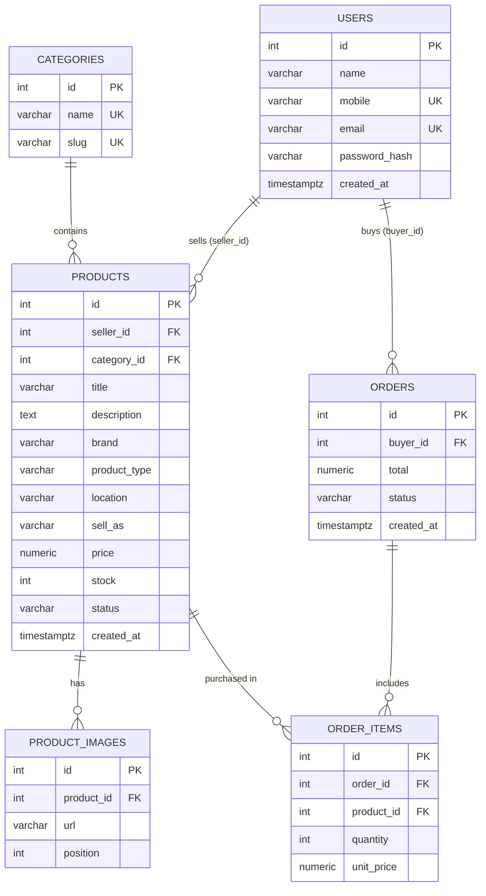

# ER Diagram — bidai_api

Entity-relationship diagram for the PostgreSQL schema (`db/schema.sql`).

## Diagram



---

## Tables & keys

| Table | PK | FK | Unique | Notes |
|-------|----|----|--------|-------|
| **users** | `id` | — | `mobile`, `email` | `password_hash` = bcrypt |
| **categories** | `id` | — | `name`, `slug` | 15 rows seeded |
| **products** | `id` | `seller_id` → users, `category_id` → categories | — | `sell_as`: vendor/individual · `status`: approved/deleted |
| **product_images** | `id` | `product_id` → products | — | 2–5 rows per product |
| **orders** | `id` | `buyer_id` → users | — | `status`: pending/paid/cancelled |
| **order_items** | `id` | `order_id` → orders, `product_id` → products | — | price snapshotted as `unit_price` |

---

## Relationships

| Relationship | Cardinality | On delete |
|--------------|-------------|-----------|
| users → products | 1 : N (`seller_id`) | CASCADE |
| users → orders | 1 : N (`buyer_id`) | CASCADE |
| categories → products | 1 : N (`category_id`) | SET NULL |
| products → product_images | 1 : N | CASCADE |
| orders → order_items | 1 : N | CASCADE |
| products → order_items | 1 : N | RESTRICT (keep order history) |

---

## Enums / check constraints

| Column | Allowed values |
|--------|----------------|
| `products.sell_as` | `vendor`, `individual` |
| `products.status` | `approved`, `deleted` |
| `orders.status` | `pending`, `paid`, `cancelled` |
| `products.price` | ≥ 0 |
| `products.stock` | ≥ 0 |
| `order_items.quantity` | > 0 |

---

## Textual ER

```
users 1 ──N products N ──1 categories
users 1 ──N products 1 ──N product_images
users 1 ──N orders 1 ──N order_items N ──1 products
```
