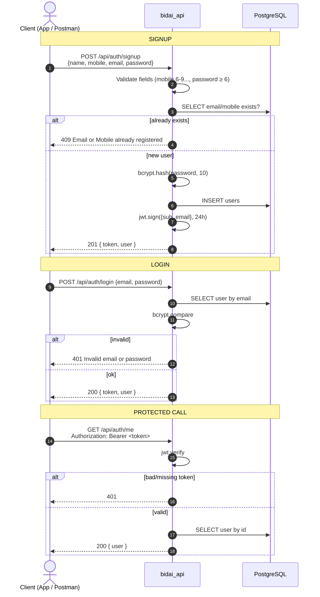
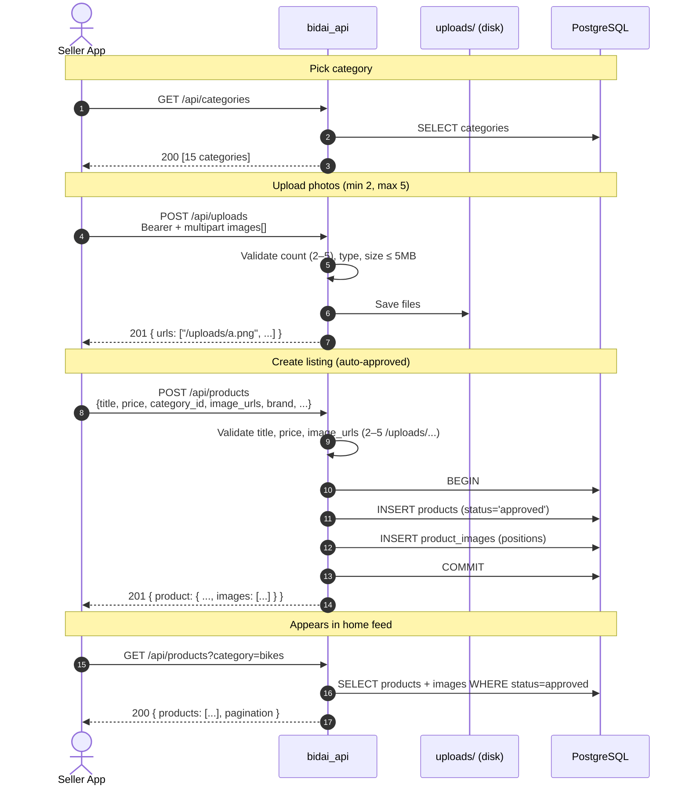
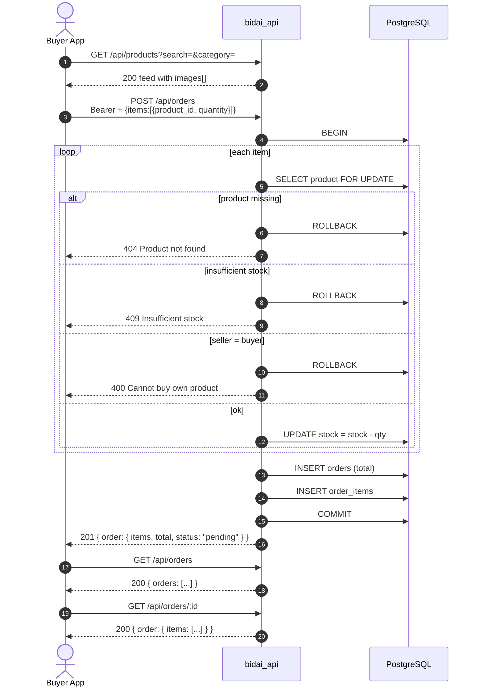
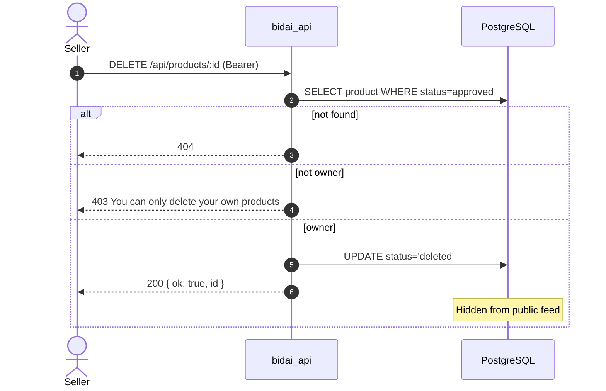
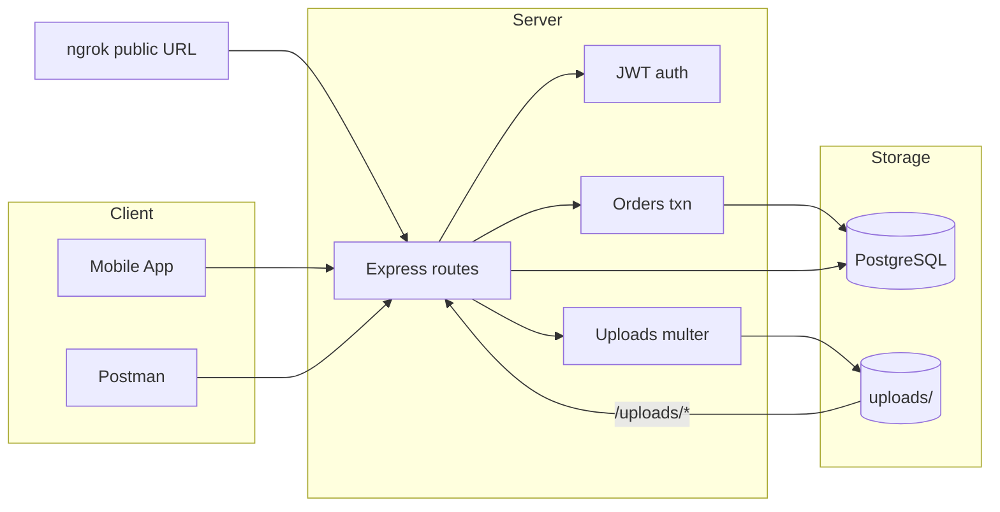

# Flow Diagrams — bidai_api

Sequence flows for auth, selling (with images), and buying.

---

## 1. Auth flow (signup / login)

---

## 2. Sell flow (categories → upload images → create product → feed)

### Sell form field mapping (mobile screens)

| Screen field | API field |
|--------------|-----------|
| Select Categories | `category_id` |
| Select or Take Photo | `POST /api/uploads` → `image_urls[]` |
| Sell as (vendor / Individual) | `sell_as` |
| Brands | `brand` |
| Select Product Type | `product_type` |
| Ad Title | `title` |
| Description | `description` |
| Price | `price` |
| Location | `location` |
| Upload | `POST /api/products` |

---

## 3. Buy / order flow (transactional stock)

---

## 4. Delete product (soft delete)

---

## High-level system flow

